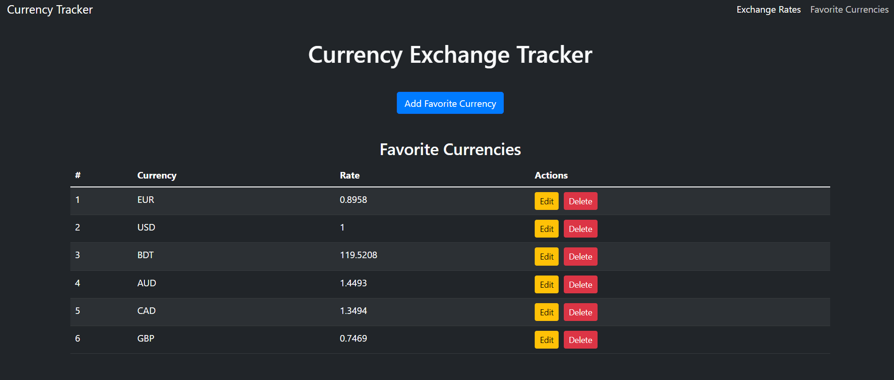

<h1>CRUD Currency Exchange Tracker App</h1>
 

 

Introducing the Currency Exchange Tracker App, a powerful tool designed to help users manage and track exchange rates effortlessly. Built with a modern, sleek UI using HTML, CSS, and JavaScript, this application integrates Bootstrap 5 for responsive design and Axios for API requests. 
Workflow:
 
Upon loading, the app fetches current exchange rates for various currencies using the ExchangeRate-API. Users can view these rates, add their favorite currencies, edit them, and delete them as needed. The app utilizes local storage to retain the list of favorite currencies, ensuring that users' preferences are preserved even after refreshing the page.
 
CRUD Functions:
 
Create: Users can add a new currency to their favorites through a modal interface.
Read: The app displays the current exchange rates and the list of favorite currencies in a structured table format.
Update: Users can edit their favorite currency codes through a dedicated modal, allowing for easy updates.
Delete: Users can remove currencies from their favorites with a simple button click.
 
Tech Stack:
 
The app is built using:

HTML/CSS: For structure and styling, leveraging Bootstrap for responsiveness and a modern UI.
 
JavaScript: For dynamic content manipulation and user interactions. 
Axios: To handle API requests for fetching real-time data. 
 
With its minimalist design and efficient functionality, the Currency Exchange Tracker App serves as a reliable resource for anyone looking to stay informed about currency fluctuations.
 
#CurrencyExchange #ExchangeRates #WebDevelopment #JavaScript #HTML #CSS #Bootstrap5 #APIDevelopment #Axios #LocalStorage #TechForGood #Fintech #DeveloperCommunity #SoftwareDevelopment #Coding #OpenSource #ResponsiveDesign #ModernWeb #UXDesign #OOP #ProjectShowcase

