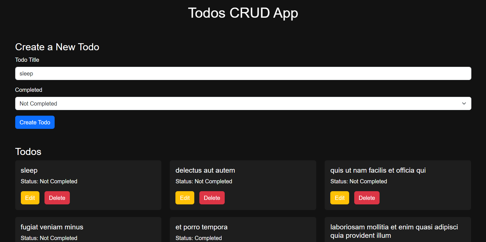

<h1>TODO CRUD APP </h1>
 

 

TODO CRUD App is a responsive web application that allows users to create, read, update, and delete posts using the JSONPlaceholder API. Built with Axios for API requests and it's fully responsive for both desktop and mobile devices.

 

[Live Demo](https://todos-crud-jsonplaceholder-api.netlify.app/)

